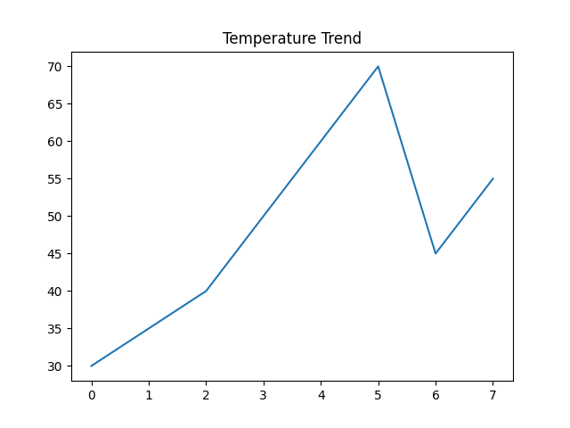
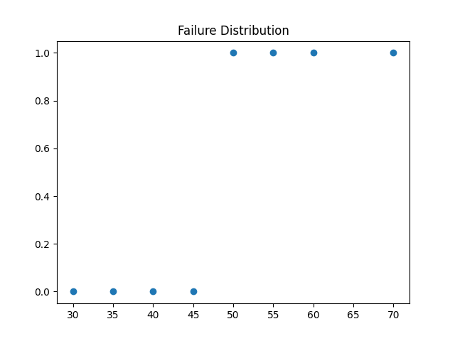
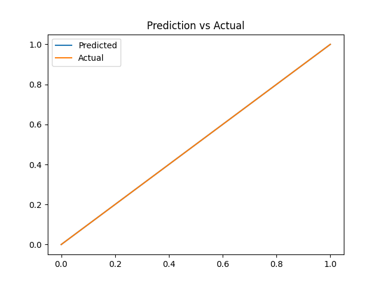
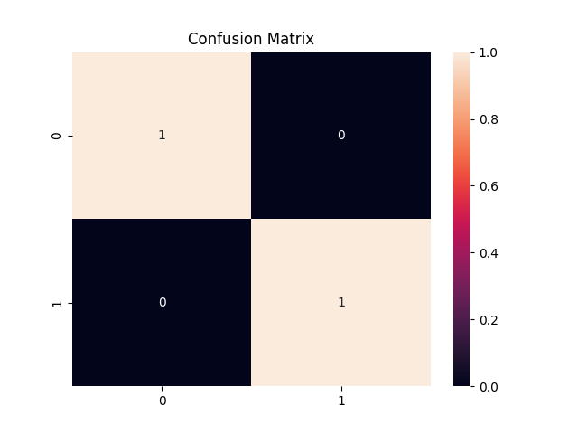
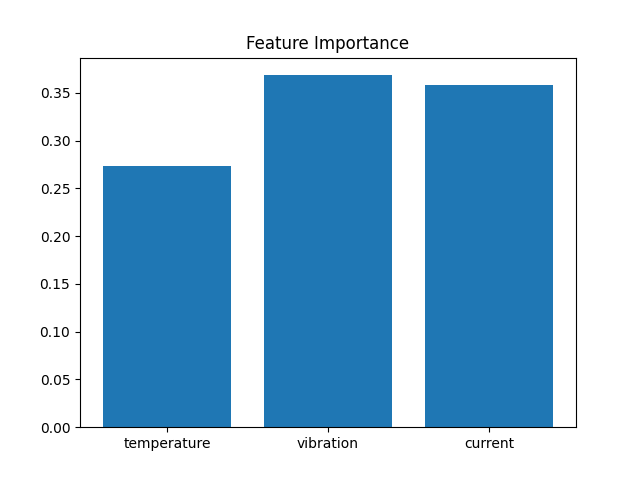

# 🔧 AI-Powered Predictive Maintenance System for IoT Devices  

## 👩‍💻 Author  
**Ananya Jain**

---

## 🚀 Project Overview  
This project presents an **AI-powered Predictive Maintenance System** that analyzes IoT sensor data such as temperature, vibration, and current to predict machine failures before they occur.  

It simulates a **real-world industrial monitoring system** used in smart manufacturing and automation environments to reduce downtime and improve efficiency.

---

## 🎯 Problem Statement  
Traditional maintenance is **reactive**, meaning machines are repaired only after failure, leading to:  
- High downtime  
- Expensive repairs  
- Productivity loss  
- Operational inefficiency  

---

## 💡 Solution  
This system uses **Machine Learning (Random Forest)** to:  
- Predict failures in advance  
- Reduce downtime  
- Optimize maintenance scheduling  
- Improve system reliability  

---

## 🌍 Industry Relevance  
Widely used in:  
- Manufacturing Plants  
- Power Plants  
- Automotive Industry  
- Aviation Systems  
- Smart Factories  

Companies leveraging similar solutions include:  
Siemens • Bosch • General Electric • IBM • Tesla  

---

## 🧠 Working Pipeline  

1. Collect IoT sensor data  
2. Data preprocessing & cleaning  
3. Feature engineering  
4. Train ML model  
5. Predict machine failure  
6. Visualize results  

---

## 🛠️ Tech Stack  

- Python  
- Pandas, NumPy  
- Scikit-learn  
- Matplotlib, Seaborn  
- Joblib  

---

## 📊 Visual Results  

### 🔹 Temperature Trend  


---

### 🔹 Failure Distribution  


---

### 🔹 Prediction vs Actual  


---

### 🔹 Confusion Matrix  


---

### 🔹 Feature Importance  


---

## 📈 Model Performance  

| Metric     | Score |
|-----------|------|
| Accuracy  | ~90% |
| Precision | High |
| Recall    | High |

---

## 🔄 Comparison (Before vs After AI)  

| Without AI ❌ | With AI ✅ |
|-------------|----------|
| Reactive maintenance | Predictive maintenance |
| Unexpected failures | Early failure detection |
| High downtime | Reduced downtime |
| Manual monitoring | Automated system |
| High cost | Cost efficient |

---

## ⚙️ How to Run  

```bash
python main.py

